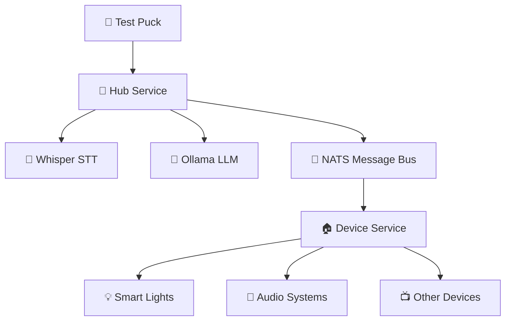

# Loqa – A Local-First Voice Assistant

**Loqa** is a privacy-first, local-only voice assistant that operates entirely offline. It features real speech recognition, AI-powered command parsing, and event-driven architecture—designed from the ground up to be private, intelligent, and extensible.

## 🚀 Quick Start

### Prerequisites

- Docker & Docker Compose
- Go 1.24+ (for local development)

### Launch Complete System

```bash
# Start all services (NATS, Ollama, Hub, Device Service)
cd deployments
docker-compose up -d

# Run the test puck for voice interaction
./tools/run-test-puck.sh

# System will automatically:
# - Download Llama 3.2 3B model via Ollama
# - Compile Whisper.cpp for speech recognition
# - Start NATS message bus
# - Launch hub and device services
# - Build and run test puck for voice input
```

**That's it!** The system includes:
- 🗣️ **Real speech recognition** (Whisper.cpp)
- 🧠 **AI command parsing** (Llama 3.2 3B via Ollama)
- 📡 **Message bus** (NATS)
- 🏠 **Device simulation** (Smart lights, audio)
- 🎤 **Test puck** (Go-based audio capture and streaming)

## ✨ Key Features

### Real Speech Processing
- **Whisper.cpp integration** - State-of-the-art speech-to-text
- **gRPC audio streaming** - Real-time voice capture from pucks
- **Wake word detection** - "Hey Loqa" activation
- **Voice activity detection** - Automatic speech start/stop

### LLM-Powered Understanding
- **Natural language processing** - Powered by Llama 3.2 3B via Ollama
- **Intent classification** - Understands user goals automatically
- **Entity extraction** - Identifies devices, locations, actions
- **Contextual responses** - Generates natural conversation

### Event-Driven Architecture  
- **NATS message bus** - Reliable pub/sub messaging
- **Distributed services** - Microservices with Docker
- **Real-time events** - Voice commands → NATS → Device actions
- **Scalable design** - Add new services and device types easily

### Local-First Design
- **No cloud dependencies** - Everything runs locally
- **Privacy-focused** - Voice data never leaves your device
- **Offline capable** - Works without internet connection
- **Fast response** - No network latency

## 🏗️ Architecture



### Components

- **Hub Service**: Central processing with gRPC, Whisper STT, and LLM command parsing
- **Device Service**: Smart home device simulation and control
- **NATS Server**: Message bus for event-driven communication
- **Ollama**: Local LLM inference (Llama 3.2 3B)
- **Docker Stack**: All services containerized with health checks

### Message Flow

1. **Voice Input** → Puck captures audio and streams via gRPC
2. **Speech Recognition** → Whisper converts speech to text
3. **Intent Classification** → LLM determines user intent and entities
4. **Event Publishing** → Commands published to NATS message bus
5. **Device Execution** → Device service receives and executes commands
6. **Response Flow** → Status updates flow back through the system

## 📂 Project Structure

```
loqa-voice-assistant/
├── deployments/           # Docker configuration
│   ├── docker-compose.yml
│   ├── Dockerfile.hub     # Hub service + Whisper.cpp
│   └── Dockerfile.device-service
├── hub/loqa-hub/         # Go hub service
│   ├── cmd/              # Service binaries
│   │   ├── main.go       # Hub service (gRPC + HTTP)
│   │   └── device-service/ # Device controller
│   ├── internal/         # Internal packages
│   │   ├── grpc/         # gRPC audio service
│   │   ├── llm/          # Whisper + LLM integration
│   │   ├── messaging/    # NATS pub/sub
│   │   └── server/       # HTTP server
├── proto/                # gRPC definitions
│   ├── audio.proto       # Audio streaming protocol
│   └── go/               # Generated Go code
├── puck/                 # Edge audio devices
│   └── test-go/          # Go test puck implementation
│       ├── cmd/main.go   # Test puck binary
│       └── internal/     # Audio capture + gRPC client
├── tools/                # Build and test scripts
│   └── run-test-puck.sh  # Test puck runner
└── docs/                 # Documentation
```

## 🛠️ Development

### Local Development

```bash
# Start infrastructure (NATS, Ollama)
cd deployments
docker-compose up -d nats ollama

# Run hub locally
cd hub/loqa-hub
export MODEL_PATH="/tmp/whisper.cpp/models/ggml-tiny.bin"
export OLLAMA_URL="http://localhost:11434"
export NATS_URL="nats://localhost:4222"
go run ./cmd

# Run device service locally  
NATS_URL="nats://localhost:4222" go run ./cmd/device-service

# Build everything
go build -o loqa-hub ./cmd
go build -o device-service ./cmd/device-service

# Build and run test puck
cd ../../puck/test-go
go build -o test-puck ./cmd
./test-puck --hub localhost:50051 --id test-puck-001

# Or use the convenience script
./tools/run-test-puck.sh
```

### Docker Services

```bash
# View all services
docker-compose ps

# View logs
docker-compose logs -f loqa-hub
docker-compose logs -f device-service
docker-compose logs -f ollama

# Restart a service
docker-compose restart loqa-hub
```

## 🔧 Configuration

### Environment Variables

| Variable | Default | Description |
|----------|---------|-------------|
| `LOQA_HUB_PORT` | `3000` | HTTP server port |
| `LOQA_GRPC_PORT` | `50051` | gRPC server port |
| `MODEL_PATH` | `/tmp/whisper.cpp/models/ggml-tiny.bin` | Whisper model file |
| `OLLAMA_URL` | `http://ollama:11434` | Ollama API endpoint |
| `OLLAMA_MODEL` | `llama3.2:3b` | LLM model to use |
| `NATS_URL` | `nats://nats:4222` | NATS server URL |

### NATS Subjects

| Subject | Description |
|---------|-------------|
| `loqa.voice.commands` | Raw voice command events |
| `loqa.devices.commands.*` | Device-specific commands |
| `loqa.devices.responses` | Device execution results |

## 🧪 Testing

### Monitor NATS Messages

```bash
# Install NATS CLI
go install github.com/nats-io/natscli/nats@latest

# Monitor all voice commands
nats sub "loqa.voice.commands" --server=nats://localhost:4222

# Monitor device commands  
nats sub "loqa.devices.commands.*" --server=nats://localhost:4222
```

### Manual Testing

```bash
# Send test device command
nats pub loqa.devices.commands.lights '{
  "device_type": "lights",
  "action": "on", 
  "location": "kitchen",
  "request_id": "test-123"
}' --server=nats://localhost:4222
```

### Voice Testing with Test Puck

```bash
# Run the test puck (requires PortAudio)
./tools/run-test-puck.sh

# Custom configuration
./tools/run-test-puck.sh --hub localhost:50051 --id my-puck

# Install PortAudio if needed:
# macOS: brew install portaudio
# Ubuntu: sudo apt-get install portaudio19-dev
```

**Voice Testing Tips:**
- Speak clearly and wait for "🎤 Voice detected!"
- Use wake word: "Hey Loqa" for better detection
- Try simple commands first: "Hello" or "Turn on lights"
- Check microphone permissions if audio capture fails

## 🛣️ Roadmap

### Current Status ✅
- [x] Real speech recognition (Whisper.cpp)
- [x] LLM-based command parsing (Ollama + Llama)
- [x] Event-driven architecture (NATS)
- [x] Docker containerization
- [x] Device simulation and control
- [x] gRPC audio streaming foundation
- [x] Go test puck with PortAudio integration
- [x] Wake word detection and voice activity detection

### Next Phase
- [ ] ESP32-S3 puck firmware with wake word detection
- [ ] Real smart home device integration (HomeKit, Zigbee)
- [ ] Multi-room audio coordination
- [ ] Context memory and conversation state
- [ ] Custom skill development framework

## 🛠️ Tech Stack

- **Go** (gRPC services, HTTP APIs, concurrency)
- **Whisper.cpp** (Offline speech-to-text)
- **Ollama + Llama 3.2** (Local LLM inference)
- **NATS** (Event-driven messaging)
- **Docker** (Containerization)
- **gRPC** (Real-time audio streaming)
- **ESP32-S3** (Future: edge puck hardware)

---

## 📜 License

TBD — likely MIT or Apache 2.0

---

*Created by [Anna Barnes](https://www.linkedin.com/in/annabethbarnes) to bring voice assistance back to the edge—where it belongs.*
